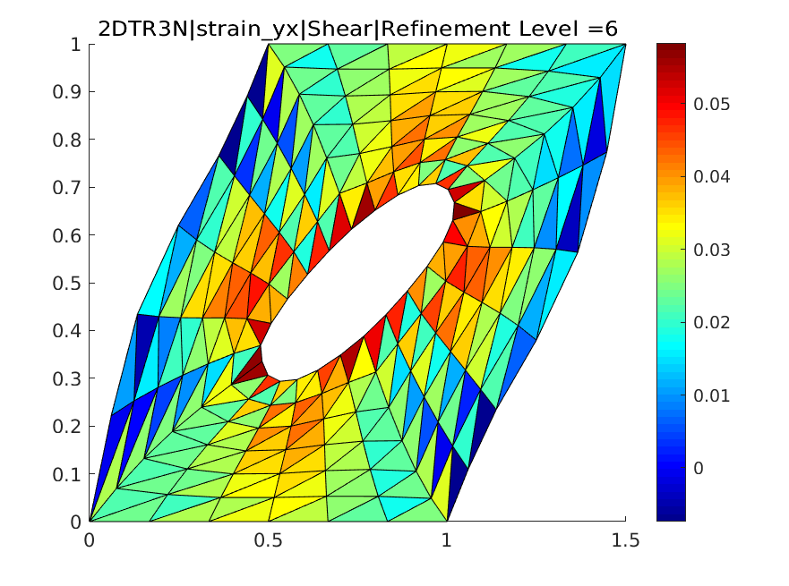

# FEM
Finite Element code written in MATLAB for ME362 Project at Bilkent University.

We designed a mini-FE package in MATLAB to study the displacement, strain, and stress distribution for a two-dimensional rectangular domain with a circular void in the middle. Example of our code output is below:

# Hi
Thank you for visiting my repository. This project would not have been possible without my teammates from Bilkent University who all put in a tremendous amount of effort:
1. Arda
2. Haritha
3. Khan
4. Oğuzhan

# How to run the code
You can run the GUI for the code with the .mlapp files on MATLAB.
Alternatively, you can also run FEM.m.